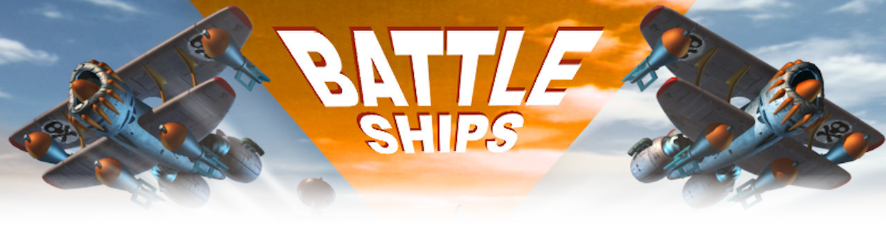
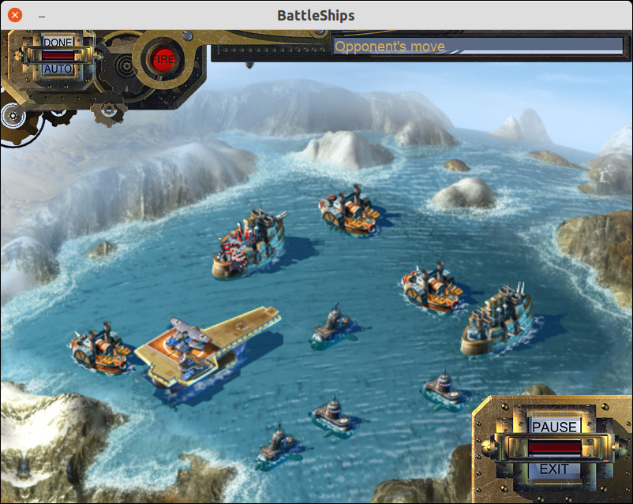
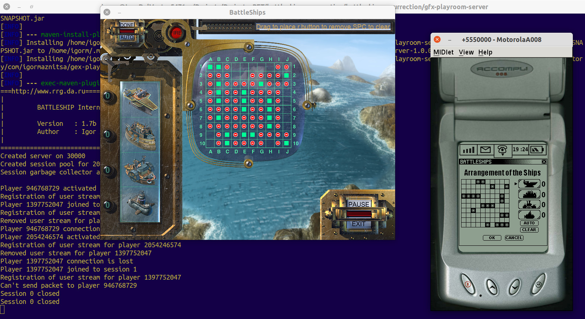

# Disclaimer
All Copyrights to both graphics and sound stuff belong to their authors. The project is already 20 years old and I can't find any footsteps of companies who took part in the project. All sources and materials have been published just to be saved for history and  provide some example of game programming in Java for who may concern.    

# What is it?
It is just memorial project in an attempt to restore and save old archived sources found on my disks. The Battleships game was developed in beginning of 2001 by request from Gamefederation company (Sweden) under umbrella of RuSoft Ltd. company (Russia). I have written pair articles on [habr.com](https://habr.com/ru/post/458124/) and in [my blog](http://raydac.blogspot.com/2015/05/the-battleships-game-e3-2001.html).

# Screen-cast
There is short screen-cast of a game session including GFX-compatible server, restored PC-client and emulated Motorola A008 client.

# Short historical review
I took a part in the project as a Java developer and both the network communication part, and the mobile game client were in my responsibility. The original PC game client was developed by another two developers in C++ exclusively for Windows (it strongly required Direct3D for work). Whole project in 2001 took 2.5 months.

Initially artists developed very detailed and smooth graphics and PC client got size about 160 Mb but then guys from Gamefederation notified us that they were going to load the PC client distributive during presentation and 160 Mb was too big size for network in 2001. As solution, the game graphics was reworked, and it started look a bit blurry. The result PC gae client size was decreased to about 60 Mb.

The network part was implemented in Java 1.2 and communicated with C++ part through JNI. Mobile client for Motorola A008 was written in J2ME for MIDP1.0/CLDC1.0.

# Requirements to build

## Mobile client
The mobile client is most hard part today to be built because it requires Sun WTK 2.5.2 and JDK 1.5, they both can be still found on Oracle site, but I am not sure that the picture will be saved next several years. I have restored some Motorola A008 device profile for the WTK, and it can be used to get picture of working device. To be honesty I have not ever saw working mobile client on the real device because during development it was an absolutely new device with GPRS support and guys in Sweden had to visit the Sweden Motorola laboratory to test the client to write report for me, very long way to debug.

To build the mobile client from project root, you need use maven profile `midlet`. 

## PC client
The PC client has been totally rewritten in pure Java 11. I didn't have sources of C++ client (only graphics and sound resources from the technical version), so that I had to restore whole game process from the scratch (but I made the best to make it as much as possible close to the original one). The most terrible part was to calculate offsets and ship arrangements on the field because I had not any contact with designers of the original game and many steps I made through guesswork. 

New client is cross-platform one (in opposite to the original one which could work only under Windows with installed Direct3D) and there are versions for Windows, Linux and MacOS. The client jar file can be started on any platform where provided JDK 11 because it doesn't use any third-part libraries and only Swing+Java2D+JavaSound in use for media.  
#### Original Windows game screenshot:

#### Restored game screenshot:

There is not any magic in build PC client. The project formed as regular maven project and can be build with `mvn`, if you want build cross-platform result images then use maven profile `publish`.

## GFX play-room server

It is the original minimalistic GFX-compatible standalone play-room server which was prepared by me for E3 2001 in april 2001. I have changed in its sources thus it contains all my one-year experience Java coding (I hope that after 20 years of Java programming my skills in programming a bit better).
The server also formed as maven project and even can be started directly through `exec:java`.

I could not find any documents of presentations about the GFX platform on my disks. As I remember it was delivered as a module for BEA WebLogic server but for E3 2001 it was too early to use such enterprise approach also it was still under development. Server is not fully production-ready because it was developed for restricted use in presentation bounds but allows organise game sessions between clients.

