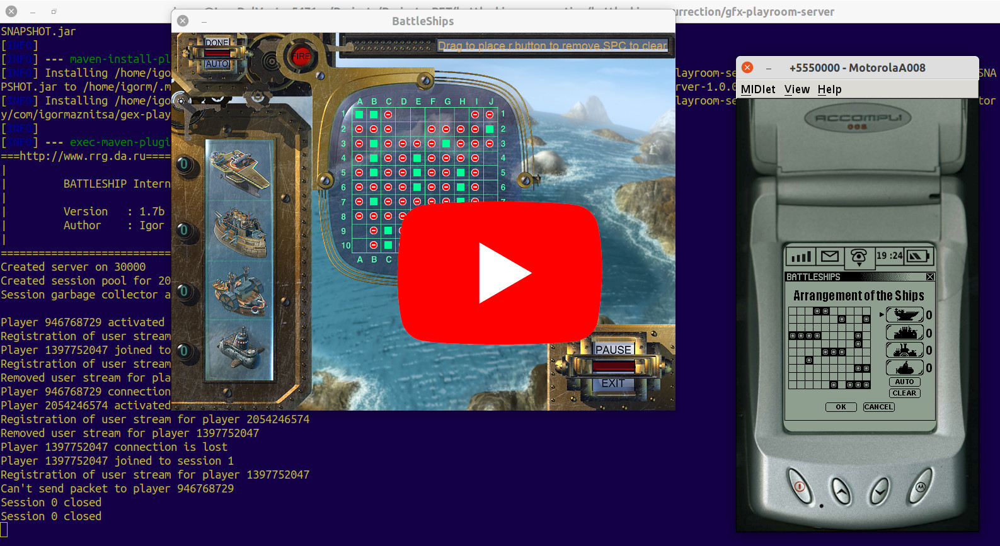

> A company called Game Federation in Sweden had created games for the Palm Pilot. They had employed Russian developers. - [Mikko Honkakorpi](https://www.linkedin.com/in/mikkoh/), ["Finnish Video Games: History and Catalog"](https://www.amazon.com/Finnish-Video-Games-History-Catalog/dp/0786499621) p.93

# Disclaimer
__All Copyrights to both graphics and sound stuff belong to their authors. The project is already 20 years old, and I can't find any footsteps of companies involved into the project. All sources and materials have been published just to be saved for history and as an example of game programming in Java for who may concern.__    

# What is it?
It is just a commemorative project in an attempt to restore and save old archived sources found on my disks.

The Battleships game project was started in the beginning of 2001 under umbrella of Ru-Soft Ltd. (Russia) by order of Gamefederation company (Sweden) and had to be completed before the E3 2001 exhibition start. I have written pair articles on [habr.com](https://habr.com/ru/post/458124/) and in [my blog](http://raydac.blogspot.com/2015/05/the-battleships-game-e3-2001.html). The project took about 2.5 months and was successfully completed in time. For me the project is remarkable one because it was my first game experience in J2ME world (a year later I would take part in a big mobile project for a Finnish company to produce 20 mobile games in two months).

# Screen-cast
There is short screen-cast of a game session including GFX-compatible server, restored PC-client and emulated Motorola A008 client.

# Pre-built components
- [PC client for Linux (64-bit, JDK image included)](https://github.com/raydac/battleships-resurrection/releases/download/1.0.0/battleships-resurrection-1.0.0-linux-x64-withjdk.tar.gz)
- [PC client for Windows (64-bit, JDK image included)](https://github.com/raydac/battleships-resurrection/releases/download/1.0.0/battleships-resurrection-1.0.0-windows-x64-withjdk.zip)
- [PC client for MacOS (64-bit, JDK image included)](https://github.com/raydac/battleships-resurrection/releases/download/1.0.0/battleships-resurrection-1.0.0-macos-x64-withjdk.zip)
- [PC client, cross-platform JAR file](https://github.com/raydac/battleships-resurrection/releases/download/1.0.0/battleships-resurrection-1.0.0.jar)  
- [pre-built GFX-compatible server (only JAR)](https://github.com/raydac/battleships-resurrection/releases/download/1.0.0/gfx-playroom-server-1.0.0.jar)
- [pre-built J2ME midlet for Motorola A008 (zipped JAD+JAR)](https://github.com/raydac/battleships-resurrection/releases/download/1.0.0/BattleShip_A008.zip)

# Short historical review
I took a part in the project as a Java developer and both the network communication part, and the mobile game client were in my responsibility. The original PC game client was developed by another two developers in C++ exclusively for Windows (it strongly required Direct3D for work).

Initially artists developed very detailed and smooth graphics and PC client got size about 160 Mb but then guys from Gamefederation notified us that they were going to load the PC client distributive during presentation and 160 Mb was too big size for network in 2001. As solution, the game graphics was reworked, and it started look a bit blurry. The result PC gae client size was decreased to about 60 Mb.

The network part was entirely implemented in Java 1.2 and communicated with C++ part through JNI. The mobile client for Motorola A008 was written in J2ME (MIDP1.0/CLDC1.0 profile).

## Team

All guys directly involved in management and development in 2001 (as I recall): 

### Producing

- [Mark Pinan](https://www.linkedin.com/in/markpinan/)
- Alexander Dymov

### Design

- Vladimir Chernysh
- [Dmitry Kholodov](https://www.linkedin.com/in/dmitry-kholodov-39394661/)

### Sound effects

- some great game sound designer (I don't remember his name)

### C++ development

- [Sergey Kuligin](https://www.linkedin.com/in/sergeykuligin/)
- a student (I don't remember his name)

### Java development

- [Christian Andersson](https://www.linkedin.com/in/christianand/)
- [Markus Persson](https://www.linkedin.com/in/markus-persson-7282513/)
- [Igor Maznitsa](https://www.linkedin.com/in/igormaznitsa/)

# Requirements to build

## Mobile client
The mobile client is most hard part today to be built because it requires Sun WTK 2.5.2 and JDK 1.5, they both can be still found on Oracle site, but I am not sure that the picture will be the same during next several years. I have restored some Motorola A008 device profile for the WTK, and it can be used to get picture of working device. To be honesty I have not ever saw working mobile client on the real device because during development it was an absolutely new device with GPRS support and guys in Sweden had to visit the Sweden Motorola laboratory to test the client to write report for me, it was very long way to debug.

To build the mobile client from the project root, you need use maven profile `midlet` and tune paths in the pom to your installed JDK 1.5 and keep in mind that the `preverify` tool is presented only for Linux. 

## PC client
The PC client has been totally rewritten in pure Java 11. I didn't have sources of C++ client (only graphics and sound resources from the technical version), so that I had to restore whole game process from the scratch (but I've made an endeavor to make it as much as possible close to the original one). The most terrible part was to calculate offsets and ship arrangements on the field because I had not any contact with designers of the original game and many steps I made through guesswork. 

The new client is cross-platform one (in opposite to the original one which could work only under Windows with installed Direct3D) and there are versions for Windows, Linux and MacOS. The client jar file can be started on any platform where provided JDK 11 because it doesn't use any third-part libraries and only Swing+Java2D+JavaSound in use for media.  

| Original PC client (Windows 10)                       | Restored PC client (Ubuntu 20.04)                |
| ----------------------------------------------------- | ------------------------------------------------ |
| ||

There is not any magic to build the PC client. The project has been formed as a regular maven project and can be build with `mvn`, if you want build cross-platform result images then use maven profile `publish`.

## GFX play-room server

It is the original minimalistic GFX-compatible standalone play-room server which was prepared by me for E3 2001 in april 2001. I have no changes in its sources, and it contains all my one-year experience Java coding (I hope that after 20 years of Java programming my skills in programming a bit better).
The server also formed as maven project and even can be started directly through `exec:java`.

I could not find either documents or presentations about the GFX platform on my disks. As I recall, the real production-ready GFX server was delivered as a module for BEA WebLogic server. The standalone solution is not fully production-ready because it was developed for restricted use in bounds of presentations but allows organising game sessions between clients.
