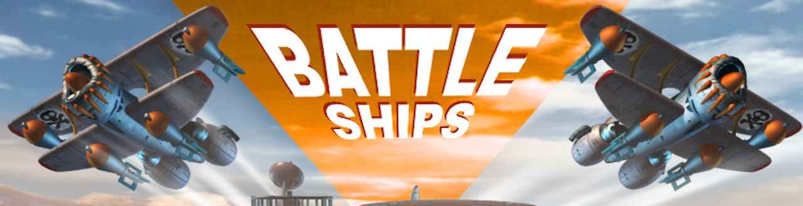
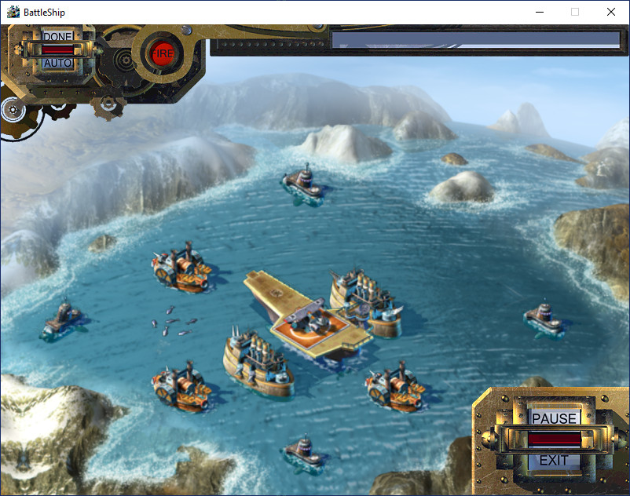

# Disclaimer
All Copyrights to both graphics and sound stuff belong to their authors. The project is already 20 years old and I can't find any footsteps of companies who played any role in the project. All sources and materials have been published just to be saved for long time and provide some example of game programming in Java for who may concern.    

# What is it?
It is just memorial project in an attempt to restore and save old archived sources found on my disks. The Battleships game was developed in beginning of 2001 by request of Gamefederation AS under umbrella of RuSoft Ltd. company. [I have written big Russian article about the project on the habr.com](https://habr.com/ru/post/458124/) and in [my blog](http://raydac.blogspot.com/2015/05/the-battleships-game-e3-2001.html).

# Short historical review
I took a part in the project as a Java developer and both the network communication part and the mobile game client were under my responsibility. The original PC game client was developed by another two programmers and could work only under Windows with installed Direct3D. During my vacation of 2021 I decided to collect graphics and sound resources which were found on archive disks and reproduce PC client in pure Java. The original PC client was developed in C++ only for Windows and required Direct3D for its work. unfortunately I have not sources of the C++ client and had to make some investigation and tests to rewrite all game process from the scratch, so that I had spent about one week to restore single player version.

Some graphics in the game looks a bit blurry. Initially our designers made very detailed high frame-ratio game and PC client became 120 Mb fat. It was inappropriate for guys from Gamefederation because they were going to load the game client through internet just during presentation (just imagine to load 120 Mb in 2001). So that our C++ team made big work to decrease size of the game, they made scaling of game elements and decreased frame-ratio (I don't remember why they did not change TGA format which was in use to keep graphics but may be there were some problems with Direct3D). In the end they got about 60 Mb distributive which was more or less appropriate one.  

The project can be also recognized as some example - "how to write a casual game in pure Java", because it uses pure Java Swing and Java2D for graphics and JavaSound API for sound and there is not any framework in use. I developed it in Agile style (without planning and thinking) so that sources can contain some specific code or footsteps of experiments but I hope they are more or less readable.

# Requirements to build

## Mobile client
The mobile client is most hard part today to be built because it requires Sun WTK 2.5.2 and JDK 1.5, they both can be still found on Oracle site but I am not sure that the picture will be saved next several years. I have restored some Motorola A008 device profile for the WTK and it can be used to get picture of working device. To be honesty I have not eer saw working mobile client on the real device because during development it was absolutely new device with GPRS support and guys in Sweden had to visit the Sweden Motorila laboratory to test the client to write report for me, very long way to debug.

To build mobile client from project root, you need use maven profile `midlet`. 

## PC client
The PC client has been totally restored in pure Java 11, I had not any piece of sources of C++ original one (even asked Sergey Kuligin about original C++ sources but he told me that he doesn't have them), so that I had to restore whole game process from the scratch. The most terrible part was to calculate offsets and ship arrangements on the field because I had not any contact with designers of the game and may of things I made by offhand.   
#### Original Windows game screenshot:

#### Restored game screenshot:

There is not any magic in build PC client. The project formed as regular maven project and can be build with `mvn`, if you want build cross-platform result images then use maven profile `publish`.

## GEX play-room server

It is the original GEX play-room server which was provided for E3 2001 in april 2001. I have changed nothing in it and it contains all my one-year experience Java coding (I hope that after 20 years of Java programming my skills have increased).
The server also formed as maven project and even can be started directly from maven with goal `exec:java`.

I could not find any stuff about the GEX platform on my disks. As I remeber it was developed as module for BEA WebLogic server but for E3 2001 it was too early to use such enterprise approach thus we developed minimalistic pure Java solution.