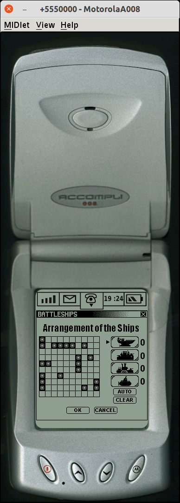

Sources of the mobile part for the BattleShips demo game written in 2001 for E3 2001.

# Requirements

To build the midlet you need only JDK 1.5 and add its path into `pom.xml`. Build process works through call of
the `build_midlet.sh` bash script. The result JAD and JAR will be generated in the root of the created `target` folder.

# Emulation

## Required build tools

- JDK 1.5, it can be downloaded
  from [Oracle site](https://www.oracle.com/java/technologies/java-archive-javase5-downloads.html)
- WTK 2.5.2 __(which also requires JDK 1.5)__, it also can be downloaded
  from [Oracle site](https://www.oracle.com/java/technologies/sun-java-wireless-toolkit.html)

WTK is required only for emulation, I have extracted `preverify` tool from WTK 1.0 (only linux version!) and saved it in
the [tools folder](tools). So that, the midlet requires only JDK 1.5 to be built.

## Prepare for emulation

- build the midlet with maven command `mvn`, it generates `BattleShip.jad` and `BattleShip.jar` in the `target` folder
- you should copy whole folder [assets/WtkDevices/MotorolaA008](assets/WtkDevices/MotorolaA008) into WTK device
  folder `wtklib/devices`

## Start emulation

- start WTK `bin/ktoolbar`
- create new project through `Create project from JAD/JAR file..` where select `target/BattleShip.jad`.
- select `MotorolaA008` as the device and press `Run` button, you should see started emulation
  

# Project structure

## BattleShip folder

The folder contains original sources of 2001, I made only minor reformatting and removed some extra `;` to make them
compilable. But they presented as I have them among my archives.

## Tools

The folder contains tools required to build a midlet.

## Assets

The folder contains additional stuff.

